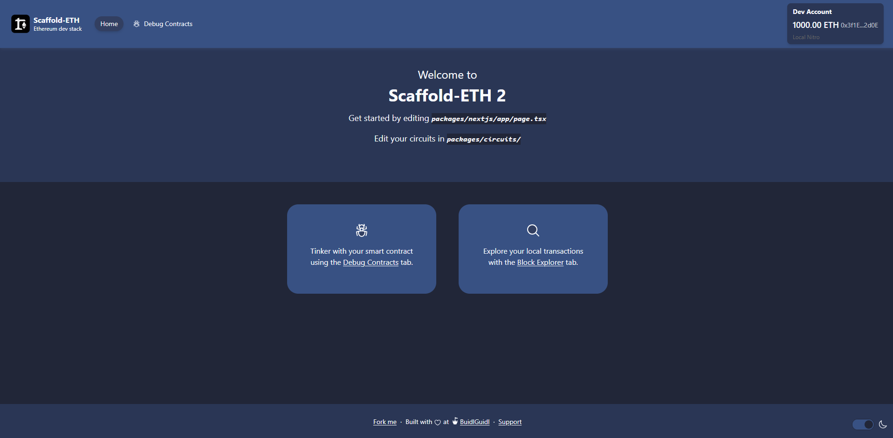
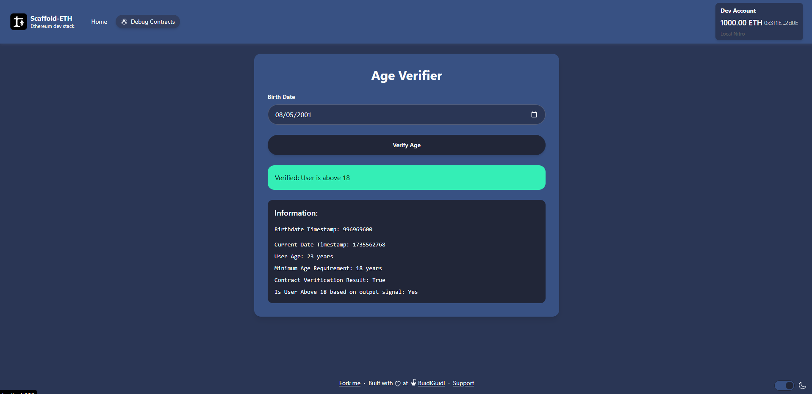
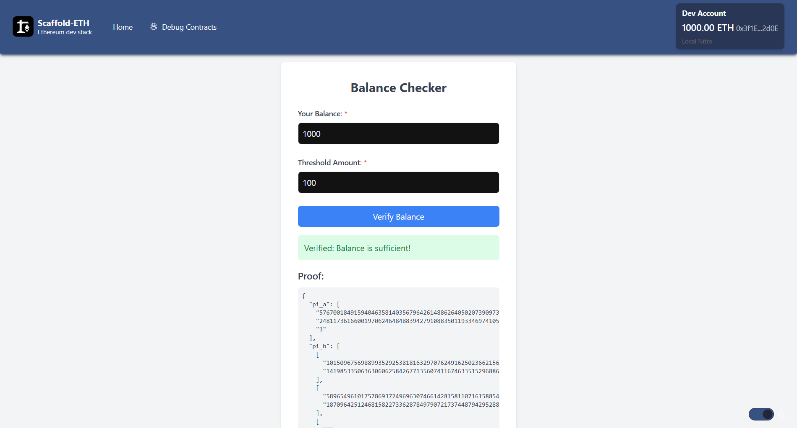
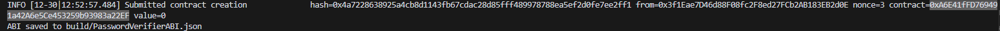
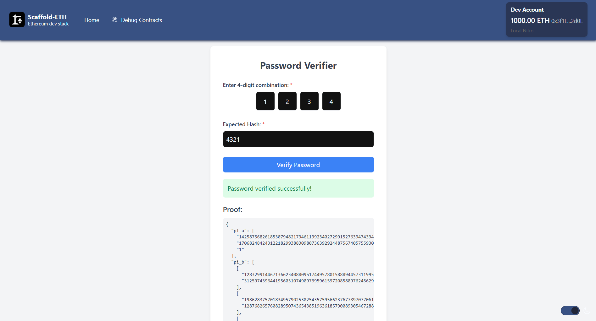

# 🛠️ ZKP-Based Contract Interaction with Arbitrum Stylus

🚀 This project demonstrates how to interact with Zero-Knowledge Proof (ZKP) circuits and smart contracts deployed on a local Arbitrum Stylus dev node. It includes three main functionalities:

1. **Age Verifier**: Verify if a user is above a certain age using ZKP.
2. **Balance Checker**: Verify if a user's balance exceeds a threshold.
3. **Password Verifier**: Verify a password combination using ZKP.

## 📦 Environment Setup

Before starting, ensure you have the following installed:

- [Node.js (>= v18.17)](https://nodejs.org/en/download/)
- [Yarn](https://classic.yarnpkg.com/en/docs/install/)
- [Git](https://git-scm.com/downloads)
- [Docker Desktop](https://www.docker.com/products/docker-desktop)

### Clone the Repository

```bash
git clone https://github.com/your-repo-name.git
cd your-repo-name
git checkout zkp
```

## 🚀 Steps to Run the Project

### Step 1: Start the Nitro Dev Node

1. Navigate to the `cargo-stylus` folder:
   ```bash
   cd packages/cargo-stylus
   ```

2. Run the `run-dev-node.sh` script:
   ```bash
   bash run-dev-node.sh
   ```
   This script:
   - Spins up an Arbitrum Stylus Nitro dev node in Docker.
   - Deploys the `AgeVerifier.sol` contract.
   - Generates the ABI for interacting with the contract.

> The dev node will be accessible at `http://localhost:8547`.

### Step 2: Start the Frontend


*The main application interface*

1. Navigate to the `nextjs` folder:
   ```bash
   cd ../nextjs
   ```

2. Install dependencies:
   ```bash
   yarn install
   ```

3. Start the development server:
   ```bash
   yarn dev
   ```

> The app will be available at [http://localhost:3000](http://localhost:3000).

## 💻 Features and Usage

### 1. Age Verifier


*Age verification interface and process flow*

- Navigate to the "Debug Contracts" tab in the frontend.
- This feature interacts with the **Age Verifier** contract, which was generated from the `AgeVerifier.circom` circuit located in `packages/circuits`.
- Circuit generation commands:
  ```bash
  circom AgeVerifier.circom --r1cs --wasm --sym
  npx snarkjs groth16 setup AgeVerifier.r1cs pot12_final.ptau AgeVerifier_0000.zkey
  npx snarkjs zkey contribute AgeVerifier_0000.zkey AgeVerifier_final.zkey --name="Contributor" -v
  npx snarkjs zkey export verificationkey AgeVerifier_final.zkey verification_key.json
  npx snarkjs zkey export solidityverifier AgeVerifier_final.zkey AgeVerifier.sol
  ```
- Choose a birthdate in the frontend to generate a zk-proof, which will be verified on-chain using the deployed `AgeVerifier.sol` contract.

### 2. Balance Checker


*Balance verification interface and process flow*

- First, you need to modify the contract deployment:
  1. In the `run-dev-node.sh` script, use `Ctrl + F` to find all occurrences of "AgeVerifier"
  2. Replace them with "BalanceChecker"
  3. Re-run the script using `bash run-dev-node.sh`
  4. After the script runs successfully, copy the deployed contract address from the terminal output
  5. Navigate to `packages/nextjs/app/balanceChecker/page.tsx`
  6. Replace the existing contract address with your newly deployed contract address as shown below :
  
- Access it at [http://localhost:3000/balanceChecker](http://localhost:3000/balanceChecker).
- Enter your balance and a threshold balance.
- The app generates a zk-proof to verify if your balance exceeds the threshold.

### 3. Password Verifier


*Password verification interface and process flow*

- First, you need to modify the contract deployment:
  1. In the `run-dev-node.sh` script, use `Ctrl + F` to find all occurrences of "AgeVerifier"
  2. Replace them with "PasswordVerifier"
  3. Re-run the script using `bash run-dev-node.sh`
  4. After the script runs successfully, copy the deployed contract address from the terminal output
  5. Navigate to `packages/nextjs/app/passwordVerifier/page.tsx`
  6. Replace the existing contract address with your newly deployed contract address as shown below : 
  
- Access it at [http://localhost:3000/passwordVerifier](http://localhost:3000/passwordVerifier).
- Example inputs:
  - Combination: `1234`
  - Expected Hash: `4321`
- The app generates a zk-proof to verify if the provided combination matches the expected hash.

## 🔧 Modify Circuits and Contracts

You can tinker with circuit logic by modifying files in the `packages/circuits` folder. After making changes, regenerate contracts using these commands:

```bash
circom <YourCircuit>.circom --r1cs --wasm --sym
npx snarkjs groth16 setup <YourCircuit>.r1cs pot12_final.ptau <YourCircuit>_0000.zkey
npx snarkjs zkey contribute <YourCircuit>_0000.zkey <YourCircuit>_final.zkey --name="Contributor" -v
npx snarkjs zkey export verificationkey <YourCircuit>_final.zkey verification_key.json
npx snarkjs zkey export solidityverifier <YourCircuit>_final.zkey <YourCircuit>.sol
```

Deploy new contracts by placing them in `packages/cargo-stylus/contracts` and running:

```bash
bash run-dev-node.sh
```

## 🛠️ Debugging Tips

### Fixing Line Endings for Shell Scripts on Windows (CRLF Issue)

If you encounter errors like `Command not found`, convert line endings to LF:

```bash
sudo apt install dos2unix
dos2unix run-dev-node.sh
chmod +x run-dev-node.sh
```

Run the script again:
```bash
bash run-dev-node.sh
```

## 🚢 Deploy Your App

To deploy your app to Vercel:

```bash
yarn vercel
```

Follow Vercel's instructions to get a public URL.

For production deployment:
```bash
yarn vercel --prod
```

## 📜 Contract Verification

You can verify your deployed smart contract using:

```bash
cargo stylus verify -e http://127.0.0.1:8547 --deployment-tx "$deployment_tx"
```

Replace `$deployment_tx` with your deployment transaction hash.

## 🏁 Next Steps

Explore more challenges or contribute to this project!

💬 Questions? Join our [developer chat](https://t.me/joinchat/F7nCRK3kI93PoCOk).