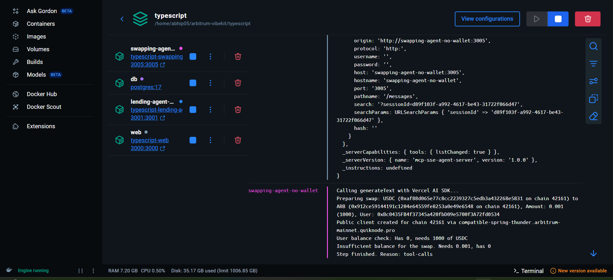
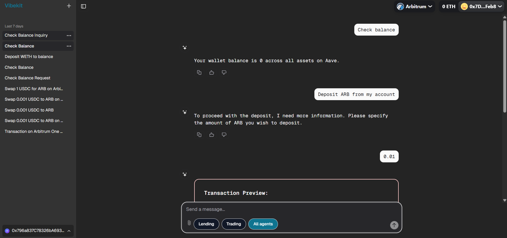
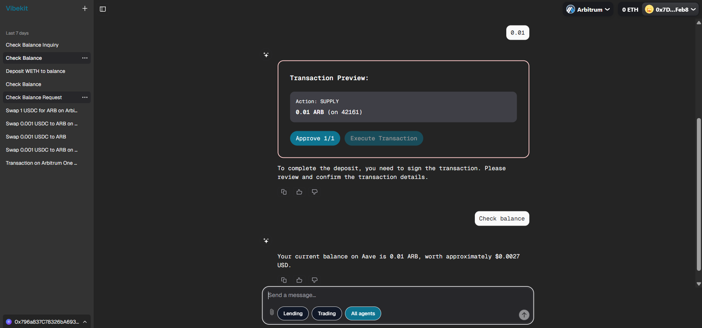
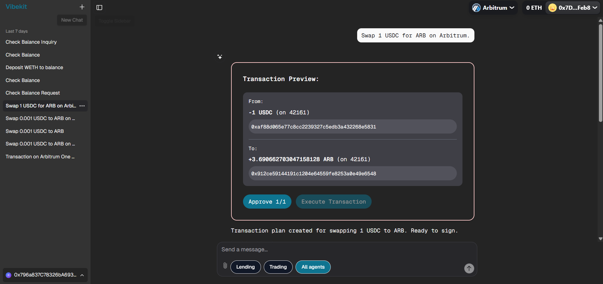
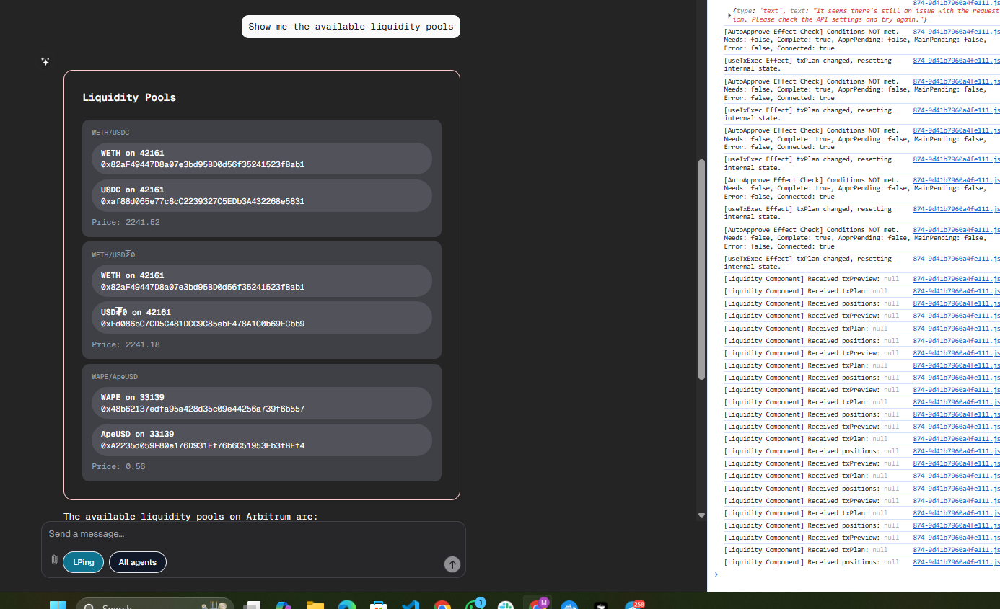
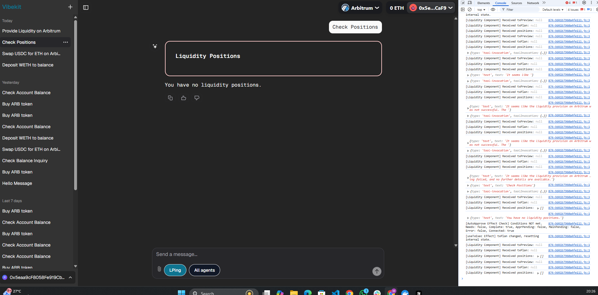
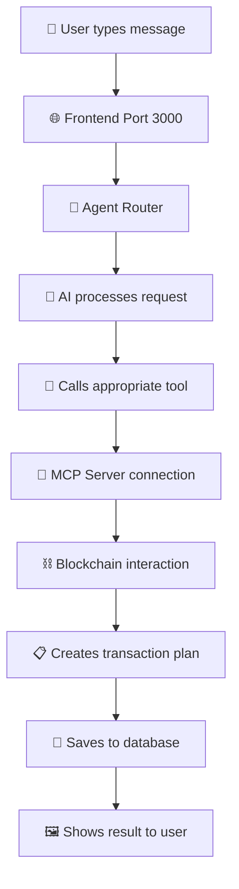
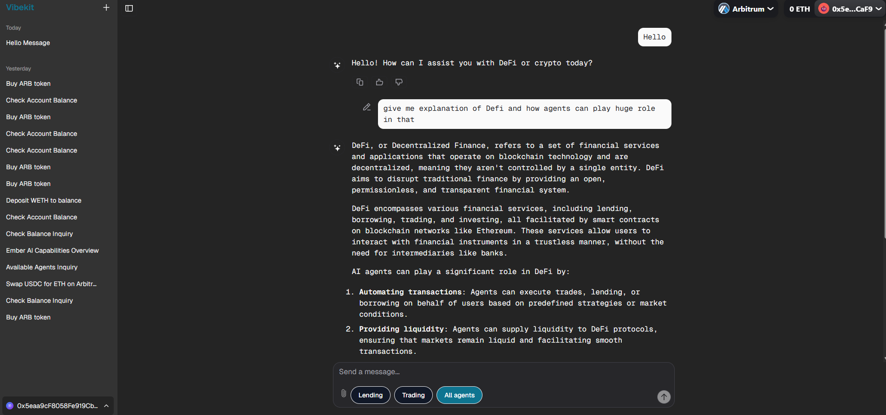

# 🚩 Challenge #12: Deep Dive into Vibekit's Three DeFi Agents

🎯 **Objective**: Master the three core DeFi agents in Vibekit and understand their deep integration with the Model Context Protocol (MCP) architecture.

📊 **Difficulty Level**: Easy to Medium

🌟 **Challenge Goal**: By the end of this challenge, you'll have a comprehensive understanding of how Vibekit's agents operate, communicate via MCP, and execute complex DeFi operations across multiple protocols.

## 🏗️ Vibekit Agent Architecture Overview

Vibekit implements a sophisticated multi-agent system where each agent specializes in specific DeFi operations. The system follows a clean separation of concerns with each agent running as an independent microservice, all orchestrated through Docker containers and unified via the MCP (Model Context Protocol).

### 🐳 Docker Service Architecture

When you run `docker compose up`, Vibekit starts the following services:

```yaml
📊 Service Overview:
├── 🌐 Web Frontend (Port 3000)
├── 🗄️  PostgreSQL Database (Internal)
├── 💰 Lending Agent (Port 3001)
├── 🔄 Swapping Agent (Port 3005)
├── 💧 Liquidity Agent (Port 3002)
└── 📈 Pendle Agent (Port 3003)
```


_Docker Desktop showing all running containers with their respective ports: Web (3000), Lending (3001), Liquidity (3002), Pendle (3003), Swapping (3005)_

---

## 🏗️ Vibekit Agent Architecture Deep Dive


### 🔑 Key Architectural Principles

**🎯 Agent-to-Agent (A2A) Protocol**: Each agent operates as an independent MCP server, enabling seamless communication and composability.

**🧠 LLM Orchestration**: AI models handle intent routing, sequential execution, conditional logic, and error recovery across all operations.

**🔧 Skill-Tool Separation**: 
- **Skills** = External interface (what users see)
- **Tools** = Internal implementation (how operations execute)

**📡 MCP Integration**: Universal protocol for connecting agents to blockchain services, ensuring consistent communication patterns.

---

## 🎯 Three Important Vibekit Agents

### 1. 💰 Lending Agent (AAVE Protocol)

**Port**: `3001` | **Container**: `lending-agent-no-wallet`

The Lending Agent specializes in AAVE protocol interactions, enabling users to supply, borrow, repay, and withdraw assets across different chains.

#### 🔧 Available Actions:

```typescript
suggestedActions: [
  {
    title: 'Deposit WETH',
    label: 'to my balance',
    action: 'Deposit WETH to my balance',
  },
  {
    title: 'Check',
    label: 'balance',
    action: 'Check balance',
  },
];
```

#### 🛠️ Core Capabilities:

- **Supply (Deposit)**: Deposit tokens to earn interest
- **Borrow**: Borrow against your collateral
- **Repay**: Pay back borrowed amounts
- **Withdraw**: Withdraw supplied tokens
- **Get Positions**: View all lending/borrowing positions
- **Ask Encyclopedia**: Query AAVE protocol documentation

#### 📊 Action Examples:

**Deposit Transaction:**

_Depositing ARB token into the AAVE protocol with transaction preview and approval flow_

**Transaction Execution:**

_Transaction approval and execution process, showing 0.01 ARB deposited balance in AAVE_

---

### 2. 🔄 Trading/Swapping Agent (Camelot DEX)

**Port**: `3005` | **Container**: `swapping-agent-no-wallet`

The Swapping Agent handles token exchanges through Camelot DEX on Arbitrum, providing optimal swap routes and price execution.

#### 🔧 Available Actions:

```typescript
suggestedActions: [
  {
    title: 'Swap USDC for ETH',
    label: 'on Arbitrum Network.',
    action: 'Swap USDC for ETH tokens from Arbitrum to Arbitrum.',
  },
  {
    title: 'Buy ARB',
    label: 'on Arbitrum.',
    action: 'Buy ARB token.',
  },
];
```

#### 🛠️ Core Capabilities:

- **Token Swaps**: Exchange one token for another
- **Price Quotes**: Get real-time swap quotes
- **Slippage Management**: Automatic slippage protection
- **Route Optimization**: Find the best trading routes
- **Multi-hop Swaps**: Execute complex multi-step trades

#### 📊 Action Examples:

**Token Swap:**

_Swapping 1 USDC for ARB on Arbitrum mainnet with transaction details and execution flow_

---

### 3. 💧 Liquidity (LPing) Agent (Camelot DEX)

**Port**: `3002` | **Container**: `liquidity-agent-no-wallet`

The Liquidity Agent manages liquidity provision on Camelot DEX, helping users provide liquidity and earn fees from trading pairs.

#### 🔧 Available Actions:

```typescript
suggestedActions: [
  {
    title: 'Provide Liquidity',
    label: 'on Arbitrum.',
    action: 'Provide Liquidity on Arbitrum.',
  },
  {
    title: 'Check',
    label: 'Liquidity positions',
    action: 'Check Positions',
  },
];
```

#### 🛠️ Core Capabilities:

- **Add Liquidity**: Provide tokens to liquidity pools
- **Remove Liquidity**: Withdraw tokens from pools
- **Position Management**: Track LP token positions
- **Yield Calculation**: Monitor earnings from fees
- **Pool Analytics**: Analyze pool performance and APR

#### 📊 Action Examples:

**Available Liquidity Pools:**

_Available liquidity pools on Arbitrum where users can provide liquidity and earn fees_

**LP Positions:**

_User's current liquidity positions showing no active positions in the portfolio_

---

## 🔄 Universal Agent Workflow: From Chat to Transaction

Let's understand how **all Vibekit agents** work using a lending example: **"Deposit 1 ARB to my balance"**.

### 🏗️ Universal Flow Overview


```mermaid
graph TB
    A[💬 User types message] --> B[🌐 Frontend Port 3000]
    B --> C[🤖 Agent Router]
    C --> D[🧠 AI processes request]
    D --> E[🔧 Calls appropriate tool]
    E --> F[🔗 MCP Server connection]
    F --> G[⛓️ Blockchain interaction]
    G --> H[📋 Creates transaction plan]
    H --> I[💾 Saves to database]
    I --> J[🖼️ Shows result to user]
```

### 🔍 Step-by-Step Universal Agent Workflow

#### Step 1: 💬 User Input

- User types any DeFi request: **"Deposit 1 ARB"**, **"Swap USDC for ETH"**, **"Provide liquidity"**
- Frontend identifies the appropriate agent based on user selection
- Routes to correct agent port: **Lending (3001)**, **Trading (3005)**, **Liquidity (3002)**

#### Step 2: 🤖 Agent Receives Message

The selected agent (`index.ts`) processes the message:

```typescript
// Agent processes the natural language request
const taskResponse = await agent.processUserInput(userMessage, userAddress);
```

#### Step 3: 🧠 AI Understanding

The agent's AI model (OpenRouter LLM) analyzes the message:

- **Understands user intent**: deposit, swap, provide liquidity, etc.
- **Determines appropriate tool**: supply, swap, addLiquidity, etc.
- **Extracts parameters**: `tokenName`, `amount`, and protocol-specific details

#### Step 4: 🔧 Tool Execution

The agent calls the relevant handler (`agentToolHandlers.ts`):

```typescript
// Different agents call different handlers
handleSupply(); // Lending Agent
handleBorrow(); // Lending Agent
handleWithdraw(); // Lending Agent
handleRepay(); // Lending Agent
handleGetUserPositions(); // Lending Agent
handleGetLiquidityPools(); // Liquidity Agent
handleGetUserLiquidityPositions(); // Liquidity Agent
handleSupplyLiquidity(); // Liquidity Agent
handleWithdrawLiquidity(); // Liquidity Agent
handleSwapTokens(); // Swapping Agent
```

Each agent validates:

- ✅ **Token/pair compatibility** with the protocol
- 🔍 **User's wallet balance** for the operation
- ❌ **Stops execution** if insufficient funds

#### Step 5: 🔗 MCP Server Communication

Agent connects to Ember AI's MCP server with protocol-specific parameters:

```typescript
// Different MCP tools for different protocols
await mcpClient.callTool({
  name: 'supply', // AAVE lending
  name: 'swap', // Camelot trading
  name: 'addLiquidity', // Camelot LP
  // Common parameters: tokenAddress, chainId, amount, userAddress
});
```

#### Step 6: ⛓️ Protocol & Blockchain Interaction

Ember AI's MCP server interacts with the relevant DeFi protocol:

- **Lending Agent**: AAVE protocol rates, health factors, liquidation thresholds
- **Trading Agent**: Camelot DEX routes, slippage calculations, price impact
- **Liquidity Agent**: Pool information, LP token calculations, fee structures

#### Step 7: 📋 Response Processing

Agent receives MCP response and builds structured output:

```typescript
return {
  status: 'completed',
  message: 'Transaction plan created. Ready to sign.',
  artifacts: [{ name: 'transaction-plan', data: protocolSpecificDetails }],
};
```

#### Step 8: 💾 Database Storage

Vibekit automatically saves all interactions across agents:

- **Chat messages**: User requests and agent responses
- **Transaction plans**: Complete transaction data for all protocols
- **Conversation history**: Cross-agent conversation tracking
- **Agent artifacts**: Protocol-specific data (AAVE positions, LP tokens, etc.)

#### Step 9: 🖼️ Frontend Display

User receives consistent interface across all agents:

- ✅ **Agent response**: Protocol-specific success message
- 📊 **Transaction preview**: Relevant details (APY, slippage, fees, etc.)
- 🖊️ **Action buttons**: "Approve" and "Execute Transaction"
- 💬 **Updated chat history**: Persistent conversation log

> **🔄 Universal Applicability**: All three agents (Lending, Trading, Liquidity) follow this exact same workflow. The only differences are in the specific tools called, MCP endpoints used, and protocol interactions performed. The core chat-to-transaction flow remains consistent across all DeFi operations.

### 🎯 Key Components Working Together

**🏠 Lending Agent Files:**

- `index.ts` - Server that receives messages
- `agent.ts` - Main logic and AI processing
- `agentToolHandlers.ts` - Actual DeFi operations
- `encyclopedia/` - 200KB+ of AAVE documentation for AI context

**💾 Chat History Management:**

- Every conversation is saved with timestamps
- Users can view/delete previous chats
- Transaction plans are stored as artifacts
- All data persists in PostgreSQL database

### 🚨 Error Handling

If something goes wrong:

- **No balance**: "Insufficient WETH balance"
- **Network issues**: "Could not verify balance"
- **MCP errors**: "Failed to create transaction plan"
- **AI errors**: Falls back to error message

This simple flow shows how Vibekit transforms natural language into blockchain transactions while keeping everything secure and user-friendly! 🚀

### 🔄 Chat History Management

Vibekit provides comprehensive chat history management:

#### 📚 Conversation Storage

```typescript
// Each conversation is stored with metadata
interface Conversation {
  id: string;
  userId: string;
  agentId: ChatAgentId;
  title: string;
  createdAt: Date;
  updatedAt: Date;
  messages: Message[];
}
```

#### 🗑️ History Management Features

Users can:

- **View All Conversations**: Browse past interactions with any agent
- **Delete Conversations**: Remove individual chat sessions
- **Clear All History**: Wipe all conversations for privacy
- **Export Conversations**: Download chat history for records


_UI showing conversation list with delete/export options for managing chat history_


---

## 🏆 How to Submit Vibekit Projects into Speedrun

🎉 **Congratulations!** You've successfully completed all the Vibekit setup steps and have your DeFi agents running locally!

Now it's time to showcase your achievement and submit your project for review. Follow these final steps to complete your speedrun submission:

### 📤 Submission Process

1. **🔄 Push Your Code**:

   - Ensure all your Vibekit code changes are committed and pushed to your GitHub repository
   - Make sure your `.env` file is **NOT** included (keep your API keys secure!)
   - Verify that your repository contains all the necessary files and configurations

2. **✅ Final Verification**:

   - Confirm that your Vibekit UI is running successfully at `http://localhost:3000`
   - Test that you can interact with at least one agent (lending, liquidity, or swapping)
   - Ensure all Docker containers are running without errors

3. **🚀 Submit Your Challenge**:
   - Navigate to the speedrun submission portal
   - Click on the **"Submit Challenge"** button
   - Paste your repository URL in the submission field
   - Add any additional notes about your implementation or customizations

---

## 🚀 Coming Soon: Next-Generation Stylus Agent

### ⚡ Rust-Powered DeFi Agent on Arbitrum Sepolia

🦀 **RUST CONTRACTS** + 🤖 **AI AGENTS** = 🚀 **NEXT-LEVEL DEFI**

We're excited to announce the upcoming integration of **Vibekit's Stylus-based Agent** - a revolutionary DeFi agent that combines the power of Rust smart contracts with AI-driven automation on Arbitrum Sepolia!

### 🎯 Key Features

**🦀 Rust Smart Contracts:**
- ⚡ **Ultra-Fast Execution**: Near-native speed with Stylus
- 🔒 **Memory Safety**: Rust's ownership model ensures security  
- 💰 **Gas Optimization**: Up to 10x cheaper than Solidity

**🤖 Agent Flow:**
```
graph LR
    subgraph "🦀 Stylus Layer"
        A[Rust Smart Contracts]
        B[Memory-Safe Execution]
        C[Gas-Optimized Logic]
    end
    
    subgraph "🤖 AI Agent Layer"
        D[Natural Language Processing]
        E[Transaction Optimization]
        F[Risk Assessment]
    end
    
    subgraph "⛓️ Arbitrum Sepolia"
        G[Lightning Fast Txns]
        H[Low Gas Costs]
        I[Ethereum Security]
    end
    
    A --> D
    B --> E
    C --> F
    D --> G
    E --> H
    F --> I
    
    style A 
    style D 
    style G 
```

### 🔥 Performance Comparison

| Feature | Traditional Solidity | 🦀 **Stylus + AI** |
|---------|---------------------|-------------------|
| **Execution Speed** | ~13ms per operation | ⚡ **~1ms per operation** |
| **Gas Efficiency** | Standard costs | 💰 **Up to 10x cheaper** |
| **Memory Safety** | Runtime errors possible | 🔒 **Compile-time guarantees** |

### 🔔 Stay Updated

⭐ **Star this repository** to get notified when the Stylus Agent launches on Arbitrum Sepolia!

> **🦀 Fun Fact**: Stylus contracts execute up to **10x faster** than traditional Solidity while maintaining full EVM compatibility!

---

## 📚 Complete Architecture Documentation

### 🔍 Deep Dive into Vibekit's Complete System

For users who want to understand the complete end-to-end architecture of Vibekit, including:

- 🏗️ **Complete Agent Architecture**: Detailed breakdown of all agent components and interactions
- 📡 **MCP Server Implementation**: How Model Context Protocol servers are structured and communicate
- 🤖 **AI Model Integration**: How LLMs process user requests and orchestrate multi-step operations
- 🔄 **Request Processing Flow**: Complete user-to-blockchain transaction lifecycle
- 🛠️ **Tool & Skill Framework**: Advanced patterns for building custom agents
- ⛓️ **Blockchain Integration**: Low-level protocol interactions and transaction management
- 🔐 **Security & Error Handling**: Comprehensive safety mechanisms and recovery strategies

Visit the complete repository documentation at: **[Vibekit Architecture Deep Dive](https://deepwiki.com/EmberAGI/arbitrum-vibekit)**

This comprehensive resource contains:
- 📖 **[Overview & Getting Started](https://deepwiki.com/EmberAGI/arbitrum-vibekit/1-overview)** - Complete system overview and setup
- 🤖 **[AI Agents Detailed Guide](https://deepwiki.com/EmberAGI/arbitrum-vibekit/4-ai-agents)** - In-depth agent implementation details
- 🏗️ **Architecture Patterns** - Advanced design patterns and best practices
- 🔧 **Implementation Examples** - Real-world code examples and tutorials

> 💡 **Pro Tip**: The DeepWiki documentation provides interactive code examples and detailed explanations that complement vibekit agents workflow perfectly!

---

_Thank you for completing the Vibekit speedrun challenges! Your contribution helps build the future of DeFi automation._ 💫