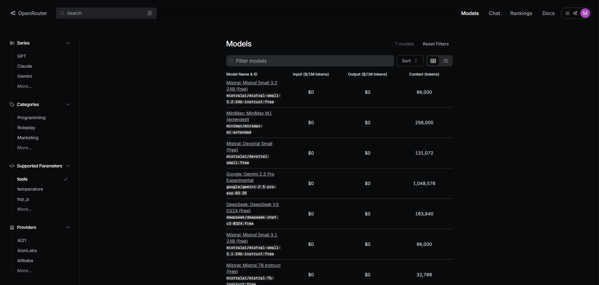
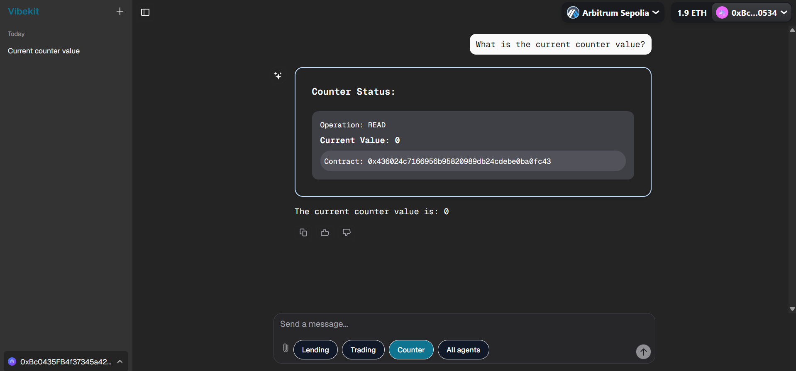
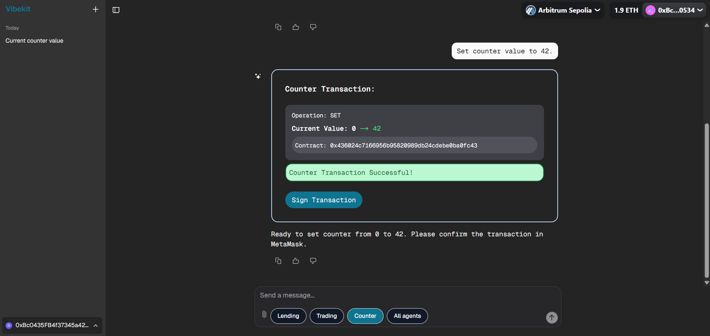
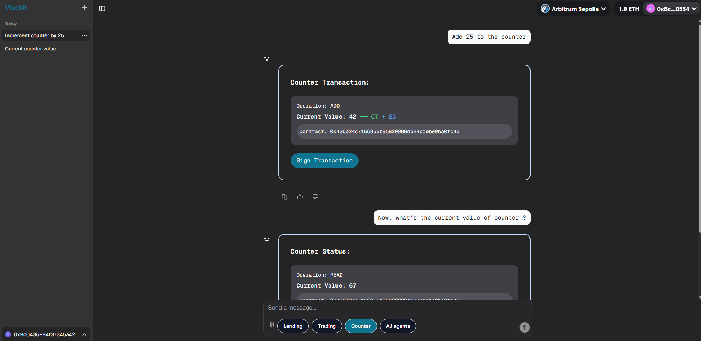
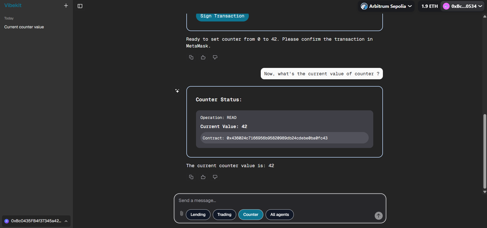
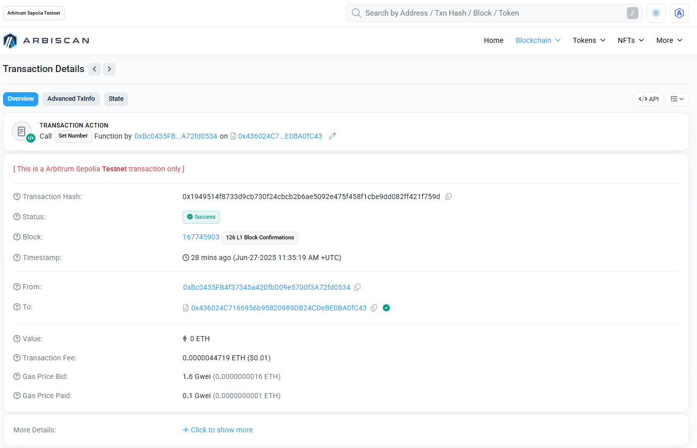

# 🚩 Challenge #11 : Setup of Vibekit Agents

🎫 Get started with Vibekit DeFi Agents:

👷‍♀️ You'll set up and interact with autonomous DeFi agents using the Vibekit framework. Then, you'll use a modern React frontend to interact with various agents including lending, liquidity, and swapping agents. Finally, you'll deploy and run agents in a Docker environment to experience the full power of DeFi automation! 🚀

🌟 The final deliverable is a fully functional Vibekit setup that lets users interact with multiple DeFi agents through a beautiful web interface.

## 📙 Introduction

Vibekit is the polyglot toolkit for vibe coding smart, autonomous DeFi agents that vibe with the blockchain. Whether you're automating trades, managing liquidity, or integrating with on-chain and off-chain data, Vibekit makes it effortless and fun.

At its core, Vibekit uses the Model Context Protocol (MCP) to standardize how agents connect with tools and data. It includes built-in Agent2Agent (A2A) integration, so the agents can easily work together. Vibekit also works smoothly with popular frameworks like Eliza and LangGraph, just add our MCP tools to your existing agents and watch them level up with DeFi superpowers!

## 🧬 Repository Organization

Vibekit is structured as a monorepo with TypeScript at its core, with a Rust implementation is on the horizon. Here's how it's organized:

- `clients/`: Clients for front-end interaction with agents.

- `templates/`: Vibekit framework agents to use as a starting template to build your own agent.

- `examples/`: Agent examples that demonstrate the use of Ember AI's MCP tools.

- `lib/`: Core libraries and tools.

- `mcp-tools/`: Implementations of MCP tools.

### 📙 For more informations you can visit the below link:

- [Vibekit Documentation](https://github.com/EmberAGI/arbitrum-vibekit)

## Checkpoint 0: 📦 Prerequisites 📚

Before starting, ensure you have the following installed:

- [Node.js (>= v18.17)](https://nodejs.org/en/download/)
- [pnpm](https://pnpm.io/installation)
- [Docker Desktop](https://www.docker.com/products/docker-desktop/)
- [WSL (for Windows users)](https://www.geeksforgeeks.org/how-to-install-wsl2-windows-subsystem-for-linux-2-on-windows-10/)

### 🔧 Version Checking

Ensure your tools versions after successful installations:

```bash
# Check your versions
pnpm --version
docker --version
docker compose version
```

> 💡 If your are on an M-series Mac, you need to install Docker using the [dmg package](https://docs.docker.com/desktop/setup/install/mac-install/) supplied officially by Docker rather than through Homebrew or other means to avoid build issues.

## ⚡ Developer Quickstart

> ⚠️ **IMPORTANT**: Vibekit currently only supports Arbitrum and Ethereum mainnet configurations. Testnet support is not available as of now.

Follow these steps to build and run an agent:

### 🚩 Setup Instructions

#### For Ubuntu/Mac Users:

1. Open your terminal.
2. Clone the repository:

   ```bash
   git clone https://github.com/EmberAGI/arbitrum-vibekit.git
   cd arbitrum-vibekit
   ```

3. Navigate to the TypeScript directory and install dependencies:

   ```bash
   cd typescript
   pnpm install
   ```

   > 💡 **Important**: After cloning the repository, you must run `pnpm install` in the typescript directory to install all project dependencies before proceeding.

4. Configure environment variables:

   ```bash
   cp .env.example .env
   ```

5. 🔑 **Configure your environment variables:**

   Edit the `.env` file and populate it with your API keys:

   **Step 1:** 🔓 Uncomment this variable:

   ```bash
   MCP_TOOL_TIMEOUT_MS=90000
   ```

   **Step 2:** 🌐 Get your OpenRouter API key:

   - Visit [🔗 OpenRouter API Keys](https://openrouter.ai/settings/keys)
   - Click "Create Key"
   - ⚠️ **Important**: Set "Credit limit (optional)" to **$0**
   - 📋 Copy the generated key and paste it in your `.env` file

   **Step 3:** 🔗 Get your QuickNode API credentials (Required for on-chain transactions):

   > ⚠️ **Important**: Any on-chain transactions like swapping, buying tokens, providing liquidity, or lending to AAVE require valid QuickNode credentials. Without them, you'll receive a **401 Unauthorized error**.

   - Visit [🔗 QuickNode Dashboard](https://dashboard.quicknode.com/endpoints)
   - Complete authentication first
   - Create an Arbitrum Mainnet endpoint to do any transaction on Arbitrum
   - Your endpoint URL will look like: `https://rough-lively-example.arbitrum-mainnet.quiknode.pro/3ergrt62e53b2d4dfiuebfiuerbfir086f1b705f07b/`

   **Configure in your `.env` file:**

   ```bash
   QUICKNODE_SUBDOMAIN=rough-lively-example
   QUICKNODE_API_KEY=3ergrt62e53b2d4dfiuebfiuerbfir086f1b705f07b
   ```

   > 💡 **Breakdown**: In the URL above, `rough-lively-example` is your **QUICKNODE_SUBDOMAIN** and `3ergrt62e53b2d4dfiuebfiuerbfir086f1b705f07b` is your **QUICKNODE_API_KEY** (everything after `arbitrum-mainnet.quiknode.pro/`).

6. Start the services with Docker Compose:

   ```bash
   docker compose up
   ```

> ℹ️ **Note:**  
> Just like the screenshot below, you'll see your agent configurations in **Docker Desktop**.  
> The displayed services will depend on the agents you've defined in your `agent-config.ts` and `compose.yml` files.
&nbsp;


7. Open [http://localhost:3000](http://localhost:3000) to see the Vibekit frontend.

### 🤖 Model Configuration & Setup

> 🚨 **IMPORTANT**: Getting errors when chatting? Read this section!

## The Default Model Problem

> ⚠️ **Error Alert**: Vibekit uses `google/gemini-2.5-pro-preview` as the default model in `typescript/clients/web/lib/ai/providers.ts`, which is a **paid model**. If you don't have credits, you'll get errors! 💥

#### How to Switch to Free Models

**🔍 Step 1: Find Free Models**

1. 🌐 Visit [OpenRouter Models](https://openrouter.ai/models)
2. 💰 From the left panel, select **"FREE"** in prompt pricing filter, also added a screenshot below for your reference
3. 📋 Browse all available free LLM models

### Here's the screenshot:


**🔄 Step 2: Replace the Model**
Replace `google/gemini-2.5-pro-preview` with your chosen free model everywhere in the code.

#### ⚠️ Model Compatibility Warning

> 🛑 **CAUTION**: Some free models don't play nice with MCP servers and will refuse connections!

**❌ Example of problematic model:**

```
google/gemma-3n-e4b-it:free → May cause errors in Vibekit
```

#### ✅ Battle-Tested Free Models with Tool Support

**⚠️ IMPORTANT**: Vibekit requires models that support **tool calling** for MCP integration! Some free models don't support tools, you can check it from OpenRouter Dashboard under supported parameters where you have to tickmark the first option tools to filter out models which support tool-support.

❌ **These free models DON'T support tools** (avoid these):
```
meta-llama/llama-4-scout:free
meta-llama/llama-4-maverick:free  
meta-llama/llama-3.3-70b-instruct:free
```

✅ **These free models DO support tools** (recommended):
```
deepseek/deepseek-chat-v3-0324:free
```

🔍 **How to Find Tool-Supporting Models**:
1. Visit [OpenRouter Models](https://openrouter.ai/models)
2. From the left panel, filter by:
   - **Prompt Pricing**: Select "FREE" 
   - **Supported Parameters**: Check the "Tools" option ✅
3. This shows only free models that support tool calling!

**📸 Visual Guide - Tool Support Filter:**


> 💡 **Pro Tip**: Always verify the "Tools" checkbox is selected to ensure compatibility with Vibekit's MCP integration!

#### 🧪 Test Before You Deploy

**Before using any model in Vibekit, test it first!**

🔗 **Testing Playground**: [OpenRouter API Reference](https://openrouter.ai/docs/api-reference/chat-completion?explorer=true)

**Testing Steps:**

1. 🔑 Enter your OpenRouter API key
2. 🎯 Select your preferred free model
3. 💬 Add a test prompt in the content parameter
4. 🚀 Click "Send Request" (upper right corner)
5. ✅ No errors = Model is Vibekit-ready!
6. ❌ Got errors = Try a different model

### For your reference here a attached screenshot:


> 💡 **Pro Tip**: Always test with a simple prompt like "Hello, how are you?" before integrating into Vibekit!

#### For Windows Users (Using WSL):

1. Open your WSL terminal.
2. Ensure you have set your Git username and email globally:

   ```bash
   git config --global user.name "Your Name"
   git config --global user.email "your.email@example.com"
   ```

3. 🔄 **From here, all steps are the same as Mac/Ubuntu users above!**

   Please follow steps 2-6 from the **"For Ubuntu/Mac Users"** section above, starting from cloning the repository.

> 📝 **Note**: All subsequent steps including model configuration are identical for Windows WSL users.

### 🛠️ Troubleshooting Common Issues

#### 1. Docker Permission Denied

If you encounter a permission denied error when running Docker commands, try running with `sudo`:

```bash
sudo docker compose up
```

#### 2. Frontend Errors or Database Issues

If you previously ran `docker compose up` with an older version and encounter errors:

1. Clear your browser cache.
2. Run the following command:
   ```bash
   docker compose down && docker volume rm typescript_db_data && docker compose build web --no-cache && docker compose up
   ```


## 💫 Checkpoint 1: Frontend Magic

> ⛽ You'll be redirected to the Vibekit dashboard after you complete checkpoint 0

The Vibekit frontend provides a beautiful interface to interact with various DeFi agents:


> Navigate through the agent selector to choose different agents like lending, liquidity, or swapping agents


The interface allows you to:

1. Select different DeFi agents
2. Chat with agents using natural language
3. Execute DeFi operations through agent interactions
4. Monitor transaction history
5. View agent reasoning and decision-making process

## Checkpoint 2: 🤖 Agents Overview

🤖 Vibekit comes with several pre-built agents that are automatically started:

> **Lending Agent**: Handles borrowing and lending operations on Aave
> **Liquidity Agent**: Manages liquidity provision on various DEXs
> **Swapping Agent**: Executes token swaps across different protocols
> **Counter Agent**: Interacts with Arbitrum Stylus smart contracts written in Rust

Each agent runs as a separate service in Docker and communicates using the MCP protocol.

---

## 🦀 Checkpoint 2.1: Counter Agent - Rust Smart Contract Integration

🚀 **Introducing the Counter Agent**: Our newest addition that showcases the power of **Arbitrum Stylus** - enabling smart contracts written in **Rust** on Arbitrum!

### 🎯 What is the Counter Agent?

The Counter Agent demonstrates seamless interaction with Rust-based smart contracts deployed on **Arbitrum Sepolia** using the revolutionary **Stylus** technology. This agent bridges the gap between AI-powered interactions and high-performance Rust smart contracts.

### ⚡ Available Functions

The Counter Agent can interact with the following smart contract functions:

```solidity
    function number() external view returns (uint256),
    function setNumber(uint256 new_number) external,
    function mulNumber(uint256 new_number) external,
    function addNumber(uint256 new_number) external,
    function increment() external,
    function addFromMsgValue() external payable,
```

### 🎮 What You Can Do

Through natural language commands, you can:

- **📊 Get Counter Value**: "What is the current counter value?"
- **🔢 Set Specific Value**: "Set the counter to 42"
- **⬆️ Increment**: "Increment the counter by 1"
- **✖️ Multiply**: "Multiply the counter by 3"
- **➕ Add Values**: "Add 25 to the counter"
- **💰 Send ETH**: "Send 0.001 ETH to add to the counter"

### 🖼️ Counter Agent in Action

Here are some examples of interacting with the Counter Agent through Vibekit's beautiful UI:

**📊 Checking Current Counter Value:**


**🔢 Setting Counter to Specific Value:**


**➕ Adding Numbers to Counter:**


**✅ Updated Counter Value Confirmation:**


### 🔍 Blockchain Verification on Arbiscan

All Counter Agent transactions are verifiable on Arbitrum Sepolia blockchain:

**📋 Contract Details on Arbiscan:**


**📊 Transaction History and Proof:**


> 🔗 **Live Contract**: View our deployed Counter contract at `0x436024c7166956b95820989db24cdebe0ba0fc43` on [Arbitrum Sepolia Explorer](https://sepolia.arbiscan.io/)

---

## 🛠️ Create Your Own Rust Smart Contracts with Stylus

**🎯 Two Options Available:**

### Option 1: 🚀 Quick Start - Use Our Deployed Contract
**Just want to interact with the existing Counter contract?** Simply add this to your `.env` file:

```bash
COUNTER_CONTRACT_ADDRESS=0x436024c7166956b95820989db24cdebe0ba0fc43
```

Then restart your Docker containers and start chatting with the Counter Agent! No deployment needed. ✨

---

### Option 2: 🛠️ Build Your Own Contract
Want to build your own Rust-powered smart contracts and integrate them with Vibekit? Here's your complete guide!


### 🚀 Stylus Development Workflow

**Step 1: Install Cargo Stylus**
```bash
# Install the Stylus CLI toolkit
cargo install --force cargo-stylus

# Add WebAssembly build target
rustup default 1.80
rustup target add wasm32-unknown-unknown --toolchain 1.80

# Verify installation
cargo stylus --help
```

**Step 2: Create Your Rust Smart Contract**
```bash
# Create a new Stylus project
cargo stylus new my-rust-contract
cd my-rust-contract
```


This generates a Rust implementation of a Counter contract similar to this Solidity version, complete RUST contract you can see at ```lib.rs``` file:
```solidity
contract Counter {
    uint count;
    
    function setCount() public {
        count = count + 1;
    }
    
    function getCount() view public returns(uint) {
        return count;
    }
}
```

**Step 3: Validate Your Contract**
```bash
# Check if your contract can be deployed (requires Docker)
cargo stylus check
```

**Success Output:**
```
✅ Program succeeded Stylus onchain activation checks with Stylus version: 1
📦 Compressed WASM size: 3 KB
```

**Step 4: Deploy Your Contract**
```bash
# Estimate deployment gas
cargo stylus deploy \
  --endpoint='https://sepolia-rollup.arbitrum.io/rpc' \
  --private-key="0xb6b15c8cb491557369f3c7d2c287b053eb229daa9c22138887752191c9520659" \
  --estimate-gas

# Deploy to arbitrum sepolia  
cargo stylus deploy \
  --endpoint='https://sepolia-rollup.arbitrum.io/rpc' \
  --private-key="0xb6b15c8cb491557369f3c7d2c287b053eb229daa9c22138887752191c9520659"
```

**Success Output:**
```
🎉 deployed code at address: 0x33f54de59419570a9442e788f5dd5cf635b3c7ac
📝 deployment tx hash: 0xa55efc05c45efc63647dff5cc37ad328a47ba5555009d92ad4e297bf4864de36
✅ wasm already activated!
```

**Step 5: Export Contract ABI**
```bash
# Generate Solidity ABI interface for your Rust contract
cargo stylus export-abi
```

**Output Example:**
```solidity
// SPDX-License-Identifier: MIT-OR-APACHE-2.0
pragma solidity ^0.8.23;

interface ICounter {
    function number() external view returns (uint256),
    function setNumber(uint256 new_number) external,
    function mulNumber(uint256 new_number) external,
    function addNumber(uint256 new_number) external,
    function increment() external,
    function addFromMsgValue() external payable,
}
```

### 🔗 Integration with Vibekit

Once you have your Rust smart contract deployed:

1. **📋 Save the Contract Address**: From the deployment output
2. **📄 Export the ABI**: Use `cargo stylus export-abi` 
3. **⚙️ Update Environment Variable**: Add your deployed contract address to `.env` file:
   ```bash
   COUNTER_CONTRACT_ADDRESS=your_deployed_contract_address_here
   ```
4. **🔄 Restart Services**: Run `docker compose down && docker compose up` to apply changes
5. **🔧 Create Agent Tools**: Integrate with Vibekit MCP tools (if creating custom agent)
6. **🤖 Configure Agent**: Add to your agent configuration (if creating custom agent)
7. **🎮 Test Interaction**: Use natural language to interact with your contract through the Counter Agent

### 📚 Learn More

- **📖 Official Docs**: [Arbitrum Stylus Documentation](https://docs.arbitrum.io/stylus/quickstart)
- **🔧 Rust SDK**: [Stylus Rust SDK Reference](https://github.com/OffchainLabs/stylus-sdk-rs)
- **💡 Examples**: Explore `arbitrum-vibekit/examples/counter-agent-no-wallet/`

---

## Checkpoint 3: 🚢 Interact with Agents

> 🎯 Start chatting with agents through the web interface at http://localhost:3000

The agents can help you with:

- **DeFi Operations**: Execute swaps, provide liquidity, borrow/lend
- **Market Analysis**: Get insights about token prices and market conditions
- **Portfolio Management**: Track and manage your DeFi positions
- **Risk Assessment**: Analyze risks before executing operations

🚀 Each interaction is powered by advanced AI that understands DeFi protocols and can execute complex operations safely.

---

## Checkpoint 4: 🔧 Customization

You can customize and extend Vibekit by:

- **Adding New Agents**: Use templates in `typescript/templates/` to create new agents
- **Modifying Existing Agents**: Edit agent configurations in `typescript/examples/`
- **Creating Custom Tools**: Implement new MCP tools in `typescript/lib/mcp-tools/`
- **Frontend Customization**: Modify the React components in `typescript/clients/web/`

📚 Check out the [Templates Documentation](https://github.com/EmberAGI/arbitrum-vibekit/tree/main/typescript/templates/quickstart-agent) for detailed guides on creating custom agents.

---

## 🏆 How to Submit Vibekit Projects into Speedrun

🎉 **Congratulations!** You've successfully completed all the Vibekit setup steps and have your DeFi agents running locally!

Now it's time to showcase your achievement and submit your project for review. Follow these final steps to complete your speedrun submission:

### 📤 Submission Process

1. **🔄 Push Your Code**:

   - Ensure all your Vibekit code changes are committed and pushed to your GitHub repository
   - Make sure your `.env` file is **NOT** included (keep your API keys secure!)
   - Verify that your repository contains all the necessary files and configurations

2. **✅ Final Verification**:

   - Confirm that your Vibekit UI is running successfully at `http://localhost:3000`
   - Test that you can interact with at least one agent (lending, liquidity, or swapping)
   - Ensure all Docker containers are running without errors

3. **🚀 Submit Your Challenge**:
   - Navigate to the speedrun submission portal
   - Click on the **"Submit Challenge"** button
   - Paste your repository URL in the submission field
   - Add any additional notes about your implementation or customizations

### 🔍 What Happens Next?

Once you submit your repository URL:

- ✨ **Acquisition**: We'll acquire your submitted repository
- 📊 **Update**: We'll update your submission count and provide feedback
- 🏅 **Recognition**: Successful submissions will be recognized in the speedrun leaderboard

### 💡 Pro Tips for Submission

- **📝 Documentation**: Include clear comments in your code if you made any customizations
- **🐛 Bug Fixes**: Document any issues you encountered and how you resolved them
- **🎨 Enhancements**: Highlight any additional features or improvements you added
- **📸 Screenshots**: Consider adding screenshots of your working setup in your repository

**Ready to submit? Click that Submit Challenge button and join the ranks of successful Vibekit developers!** 🚀

---

_Thank you for completing the Vibekit speedrun challenge! Your contribution helps build the future of DeFi automation._ 💫
